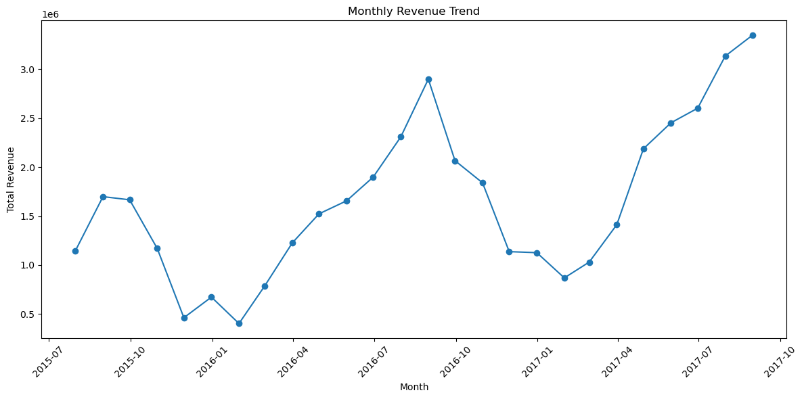
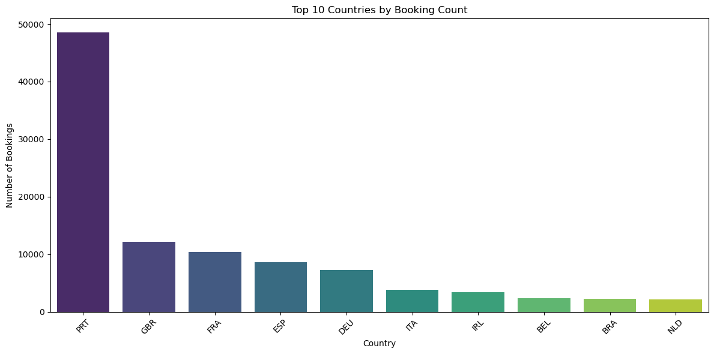
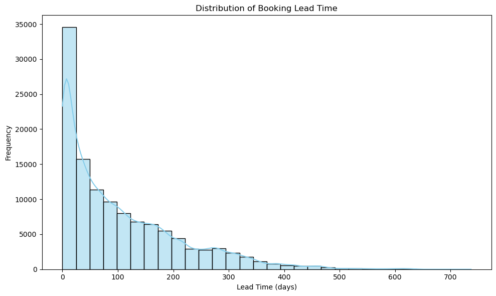
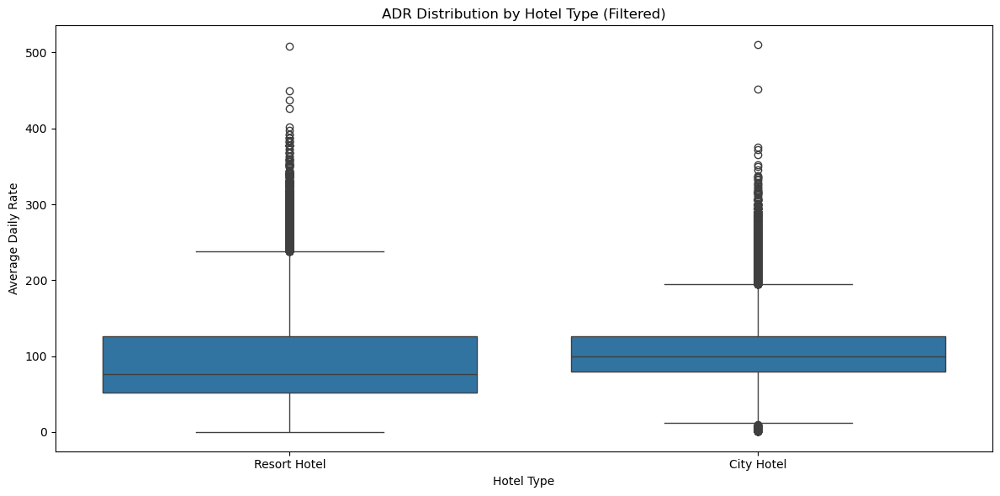
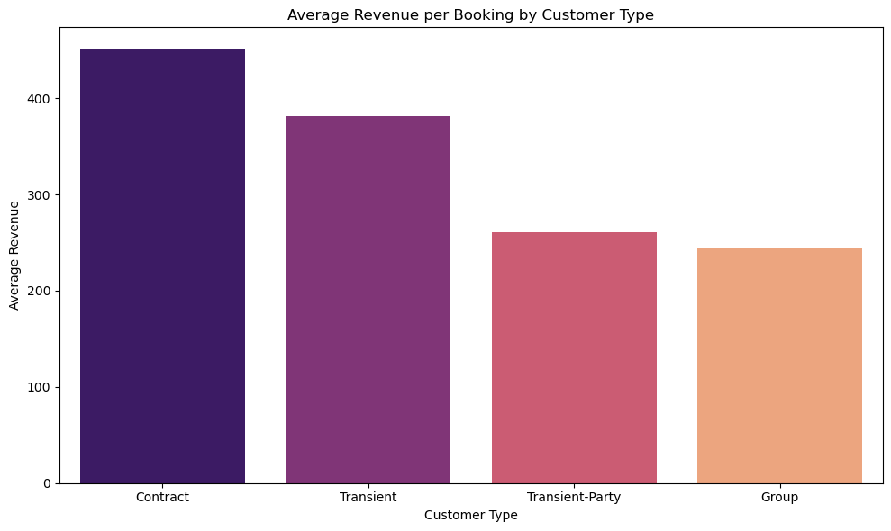
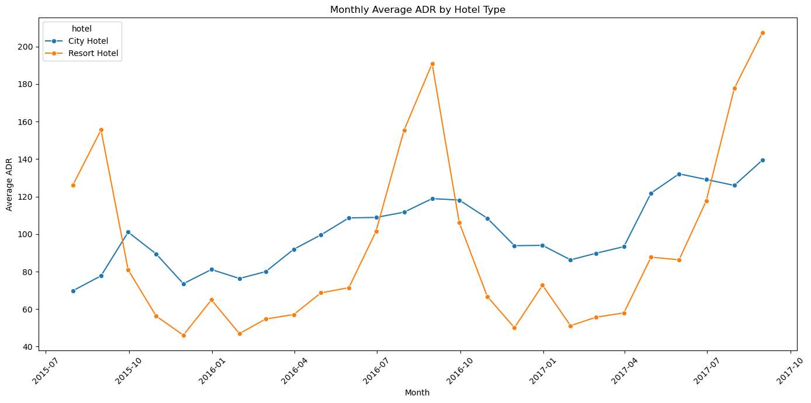
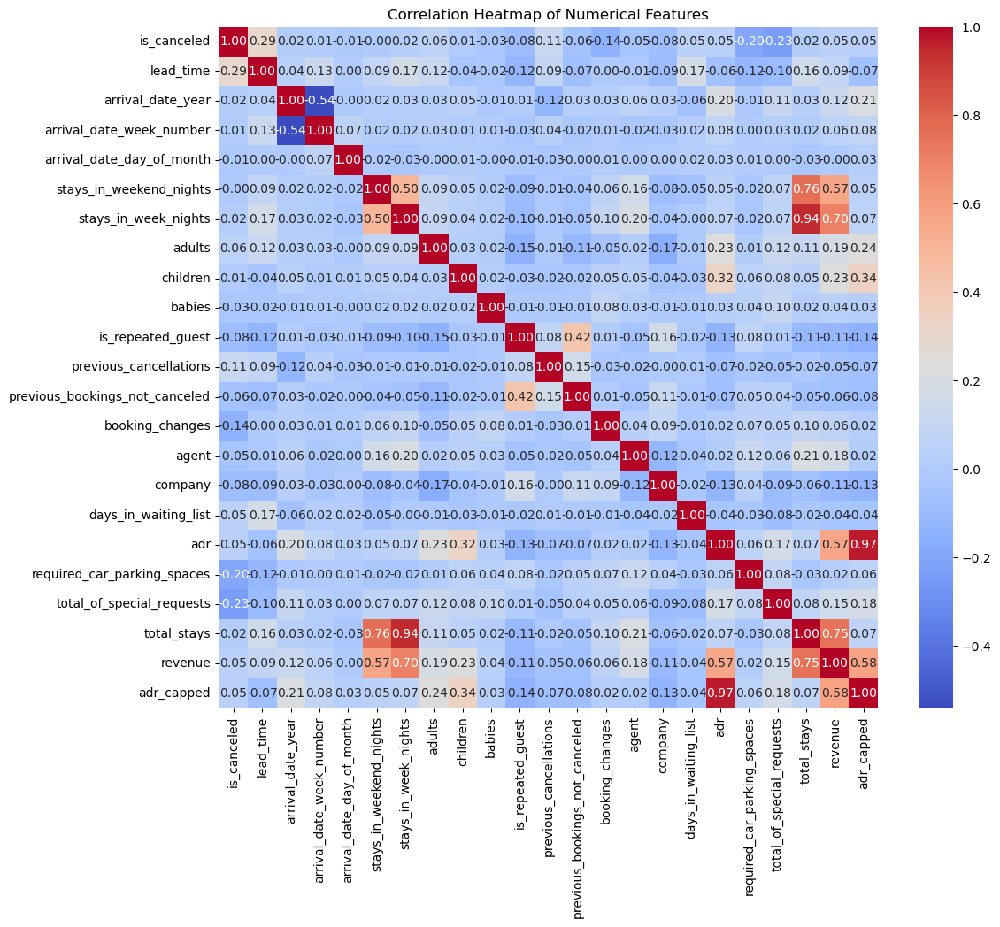
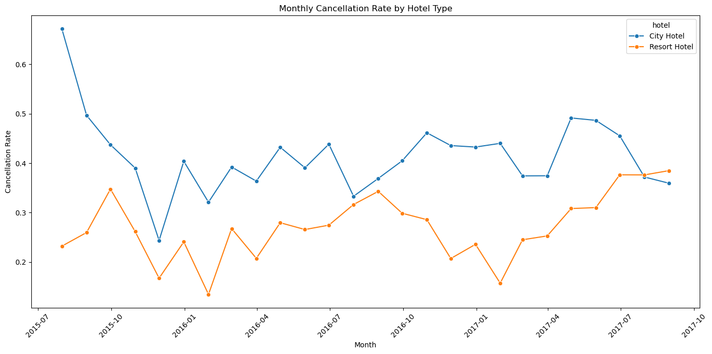
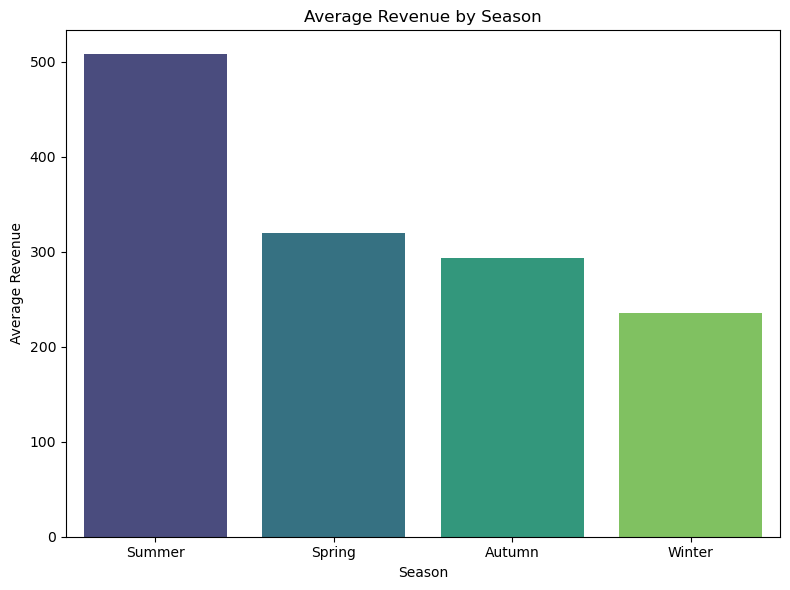

# LLM-Powered Booking Analytics & QA System

### Objective
Develop a system that processes hotel booking data, extracts insights, and enables retrieval-augmented question answering (RAG). The system should provide analytics as mentioned in below sections and answer user queries about the dat.

### Contents
- Dataset Loading
- Data Preprocessing
- Data Analysis and Visaulization
- Processed Data CSV Export

**Links:**
- [arindal1 github](www.github.com/arindal1)
- [arindal1 linkedin](www.linkedin.com/in/arindalchar)
- [dataset](https://solvei8-aiml-assignment.s3.ap-southeast-1.amazonaws.com/hotel_bookings.csv)a


```python
!pip install pandas numpy matplotlib seaborn fastapi uvicorn sentence-transformers transformers faiss-cpu langchain
```

## Data Collection and Pre


```python
import pandas as pd
import numpy as np
```


```python
# Load the dataset
df = pd.read_csv("data/hotel_bookings.csv")

# Display basic info
print("Dataset Shape:", df.shape)
print(df.info())
print(df.head())
```

    Dataset Shape: (119390, 32)
    <class 'pandas.core.frame.DataFrame'>
    RangeIndex: 119390 entries, 0 to 119389
    Data columns (total 32 columns):
     #   Column                          Non-Null Count   Dtype  
    ---  ------                          --------------   -----  
     0   hotel                           119390 non-null  object 
     1   is_canceled                     119390 non-null  int64  
     2   lead_time                       119390 non-null  int64  
     3   arrival_date_year               119390 non-null  int64  
     4   arrival_date_month              119390 non-null  object 
     5   arrival_date_week_number        119390 non-null  int64  
     6   arrival_date_day_of_month       119390 non-null  int64  
     7   stays_in_weekend_nights         119390 non-null  int64  
     8   stays_in_week_nights            119390 non-null  int64  
     9   adults                          119390 non-null  int64  
     10  children                        119386 non-null  float64
     11  babies                          119390 non-null  int64  
     12  meal                            119390 non-null  object 
     13  country                         118902 non-null  object 
     14  market_segment                  119390 non-null  object 
     15  distribution_channel            119390 non-null  object 
     16  is_repeated_guest               119390 non-null  int64  
     17  previous_cancellations          119390 non-null  int64  
     18  previous_bookings_not_canceled  119390 non-null  int64  
     19  reserved_room_type              119390 non-null  object 
     20  assigned_room_type              119390 non-null  object 
     21  booking_changes                 119390 non-null  int64  
     22  deposit_type                    119390 non-null  object 
     23  agent                           103050 non-null  float64
     24  company                         6797 non-null    float64
     25  days_in_waiting_list            119390 non-null  int64  
     26  customer_type                   119390 non-null  object 
     27  adr                             119390 non-null  float64
     28  required_car_parking_spaces     119390 non-null  int64  
     29  total_of_special_requests       119390 non-null  int64  
     30  reservation_status              119390 non-null  object 
     31  reservation_status_date         119390 non-null  object 
    dtypes: float64(4), int64(16), object(12)
    memory usage: 29.1+ MB
    None
              hotel  is_canceled  lead_time  arrival_date_year arrival_date_month  \
    0  Resort Hotel            0        342               2015               July   
    1  Resort Hotel            0        737               2015               July   
    2  Resort Hotel            0          7               2015               July   
    3  Resort Hotel            0         13               2015               July   
    4  Resort Hotel            0         14               2015               July   
    
       arrival_date_week_number  arrival_date_day_of_month  \
    0                        27                          1   
    1                        27                          1   
    2                        27                          1   
    3                        27                          1   
    4                        27                          1   
    
       stays_in_weekend_nights  stays_in_week_nights  adults  ...  deposit_type  \
    0                        0                     0       2  ...    No Deposit   
    1                        0                     0       2  ...    No Deposit   
    2                        0                     1       1  ...    No Deposit   
    3                        0                     1       1  ...    No Deposit   
    4                        0                     2       2  ...    No Deposit   
    
       agent company days_in_waiting_list customer_type   adr  \
    0    NaN     NaN                    0     Transient   0.0   
    1    NaN     NaN                    0     Transient   0.0   
    2    NaN     NaN                    0     Transient  75.0   
    3  304.0     NaN                    0     Transient  75.0   
    4  240.0     NaN                    0     Transient  98.0   
    
       required_car_parking_spaces  total_of_special_requests  reservation_status  \
    0                            0                          0           Check-Out   
    1                            0                          0           Check-Out   
    2                            0                          0           Check-Out   
    3                            0                          0           Check-Out   
    4                            0                          1           Check-Out   
    
      reservation_status_date  
    0                01-07-15  
    1                01-07-15  
    2                02-07-15  
    3                02-07-15  
    4                03-07-15  
    
    [5 rows x 32 columns]
    


```python
# 1. Convert arrival date columns into a single datetime column.
# Note: 'arrival_date_month' is given as full month name (e.g., "July").

df['arrival_date'] = pd.to_datetime(
    df['arrival_date_year'].astype(str) + '-' +
    df['arrival_date_month'] + '-' +
    df['arrival_date_day_of_month'].astype(str),
    format='%Y-%B-%d',
    errors='coerce'  # in case some dates cannot be parsed
)
```


```python
# 2. Convert reservation_status_date into datetime (assumed format: dd-mm-yy)
df['reservation_status_date'] = pd.to_datetime(df['reservation_status_date'], format='%d-%m-%y', errors='coerce')
```


```python
# 3. Handle missing values:
#    - For numerical columns like 'children', fill with 0 or median if appropriate.
df['children'] = df['children'].fillna(0)
#    - For 'agent' and 'company', fill missing values with a placeholder (e.g., 0 or "Unknown")
df['agent'] = df['agent'].fillna(0)
df['company'] = df['company'].fillna(0)
#    - For 'country', fill missing with "Unknown"
df['country'] = df['country'].fillna("Unknown")
```


```python
# 4. Derive additional columns:
# Total number of nights stayed (week + weekend)
df['total_stays'] = df['stays_in_week_nights'] + df['stays_in_weekend_nights']
```


```python
# Calculate estimated revenue:
# Revenue = adr * total nights stayed.
# (Assuming each booking's revenue is approximated by the average daily rate times total nights.)
df['revenue'] = df['adr'] * df['total_stays']
```


```python
# Display the updated dataframe structure
print("\nPreprocessed Data:")
print(df[['arrival_date', 'reservation_status_date', 'total_stays', 'revenue']].head())
```

    
    Preprocessed Data:
      arrival_date reservation_status_date  total_stays  revenue
    0   2015-07-01              2015-07-01            0      0.0
    1   2015-07-01              2015-07-01            0      0.0
    2   2015-07-01              2015-07-02            1     75.0
    3   2015-07-01              2015-07-02            1     75.0
    4   2015-07-01              2015-07-03            2    196.0
    


```python
# Function to determine season based on the month (assuming northern hemisphere)
def get_season(date):
    month = date.month
    if month in [12, 1, 2]:
        return 'Winter'
    elif month in [3, 4, 5]:
        return 'Spring'
    elif month in [6, 7, 8]:
        return 'Summer'
    else:
        return 'Autumn'

# Apply function to create a new 'season' column (ensure arrival_date is in datetime format)
df['season'] = df['arrival_date'].apply(lambda x: get_season(x) if pd.notnull(x) else 'Unknown')

# Verify the new feature
print("Season distribution:")
print(df['season'].value_counts())
```

    Season distribution:
    season
    Summer    37477
    Spring    32674
    Autumn    28462
    Winter    20777
    Name: count, dtype: int64
    

## Analytics and Visualization


```python
import matplotlib.pyplot as plt
import seaborn as sns
```


```python
# Group by arrival_date (monthly)
revenue_trend = df.groupby(pd.Grouper(key='arrival_date', freq='M'))['revenue'].sum()

plt.figure(figsize=(12, 6))
plt.plot(revenue_trend.index, revenue_trend.values, marker='o')
plt.title('Monthly Revenue Trend')
plt.xlabel('Month')
plt.ylabel('Total Revenue')
plt.xticks(rotation=45)
plt.tight_layout()
plt.show()
```


    

    


```python
# is_canceled: 1 means canceled, 0 means not canceled.
total_bookings = len(df)
total_cancellations = df['is_canceled'].sum()
cancellation_rate = (total_cancellations / total_bookings) * 100

print(f"Overall Cancellation Rate: {cancellation_rate:.2f}%")
```

    Overall Cancellation Rate: 37.04%
    


```python
# Count bookings per country
country_counts = df['country'].value_counts().sort_values(ascending=False)

plt.figure(figsize=(12, 6))
sns.barplot(x=country_counts.index[:10], y=country_counts.values[:10], palette='viridis')
plt.title('Top 10 Countries by Booking Count')
plt.xlabel('Country')
plt.ylabel('Number of Bookings')
plt.xticks(rotation=45)
plt.tight_layout()
plt.show()
```

    C:\Users\Arindal Char\AppData\Local\Temp\ipykernel_15688\2707114378.py:5: FutureWarning: 
    
    Passing `palette` without assigning `hue` is deprecated and will be removed in v0.14.0. Assign the `x` variable to `hue` and set `legend=False` for the same effect.
    
      sns.barplot(x=country_counts.index[:10], y=country_counts.values[:10], palette='viridis')
    


    

    


```python
# Histogram of the lead times.

plt.figure(figsize=(10, 6))
sns.histplot(df['lead_time'], bins=30, kde=True, color='skyblue')
plt.title('Distribution of Booking Lead Time')
plt.xlabel('Lead Time (days)')
plt.ylabel('Frequency')
plt.tight_layout()
plt.show()
```


    

    


```python
# Cap the ADR to a maximum value (optional, adjust threshold as per domain knowledge)
adr_cap = 1000
df['adr_capped'] = df['adr'].apply(lambda x: min(x, adr_cap))
```


```python
plt.figure(figsize=(12, 6))
sns.boxplot(x='hotel', y='adr', data=df_filtered)
plt.title('ADR Distribution by Hotel Type (Filtered)')
plt.xlabel('Hotel Type')
plt.ylabel('Average Daily Rate')
plt.tight_layout()
plt.show()
```


    

    


```python
# Average Revenue per Booking by Customer Type

# Group by customer_type and calculate average revenue
avg_revenue_by_customer = df.groupby('customer_type')['revenue'].mean().sort_values(ascending=False)
print("Average Revenue by Customer Type:")
print(avg_revenue_by_customer)

plt.figure(figsize=(10, 6))
sns.barplot(x=avg_revenue_by_customer.index, y=avg_revenue_by_customer.values, palette='magma')
plt.title('Average Revenue per Booking by Customer Type')
plt.xlabel('Customer Type')
plt.ylabel('Average Revenue')
plt.tight_layout()
plt.show()
```

    Average Revenue by Customer Type:
    customer_type
    Contract           451.196700
    Transient          381.631057
    Transient-Party    260.493376
    Group              243.813328
    Name: revenue, dtype: float64
    

    C:\Users\Arindal Char\AppData\Local\Temp\ipykernel_15688\282020276.py:9: FutureWarning: 
    
    Passing `palette` without assigning `hue` is deprecated and will be removed in v0.14.0. Assign the `x` variable to `hue` and set `legend=False` for the same effect.
    
      sns.barplot(x=avg_revenue_by_customer.index, y=avg_revenue_by_customer.values, palette='magma')
    


    

    


```python
# Group by month and hotel type to calculate mean ADR
adr_trend_hotel = df.groupby([pd.Grouper(key='arrival_date', freq='M'), 'hotel'])['adr'].mean().reset_index()

plt.figure(figsize=(14,7))
sns.lineplot(data=adr_trend_hotel, x='arrival_date', y='adr', hue='hotel', marker='o')
plt.title('Monthly Average ADR by Hotel Type')
plt.xlabel('Month')
plt.ylabel('Average ADR')
plt.xticks(rotation=45)
plt.tight_layout()
plt.show()
```


    

    


```python
# Correlation Heatmap of Numerical Features
numeric_cols = df.select_dtypes(include=[np.number])

plt.figure(figsize=(12, 10))
corr = numeric_cols.corr()
sns.heatmap(corr, annot=True, fmt=".2f", cmap="coolwarm")
plt.title('Correlation Heatmap of Numerical Features')
plt.show()
```


    

    


```python
# Cancellation Rate by Month and Hotel Type

# Calculate monthly cancellation rate per hotel type (is_canceled is 1 for canceled, 0 for not canceled)
cancellation_by_month_hotel = df.groupby([pd.Grouper(key='arrival_date', freq='M'), 'hotel'])['is_canceled'].mean().reset_index()

plt.figure(figsize=(14,7))
sns.lineplot(data=cancellation_by_month_hotel, x='arrival_date', y='is_canceled', hue='hotel', marker='o')
plt.title('Monthly Cancellation Rate by Hotel Type')
plt.xlabel('Month')
plt.ylabel('Cancellation Rate')
plt.xticks(rotation=45)
plt.tight_layout()
plt.show()
```


    

    


```python
# Average Revenue by Season

# Group by the new 'season' column and calculate average revenue
avg_revenue_by_season = df.groupby('season')['revenue'].mean().sort_values(ascending=False)
print("Average Revenue by Season:")
print(avg_revenue_by_season)

plt.figure(figsize=(8,6))
sns.barplot(x=avg_revenue_by_season.index, y=avg_revenue_by_season.values, palette='viridis')
plt.title('Average Revenue by Season')
plt.xlabel('Season')
plt.ylabel('Average Revenue')
plt.tight_layout()
plt.show()
```

    Average Revenue by Season:
    season
    Summer    507.826623
    Spring    320.065285
    Autumn    293.079306
    Winter    235.464351
    Name: revenue, dtype: float64
    

    C:\Users\Arindal Char\AppData\Local\Temp\ipykernel_15688\586029692.py:9: FutureWarning: 
    
    Passing `palette` without assigning `hue` is deprecated and will be removed in v0.14.0. Assign the `x` variable to `hue` and set `legend=False` for the same effect.
    
      sns.barplot(x=avg_revenue_by_season.index, y=avg_revenue_by_season.values, palette='viridis')
    


    

    


---

## Export Processed Data


```python
df.to_csv("hotel_bookings_preprocessed.csv", index=False)
```


```python

```
